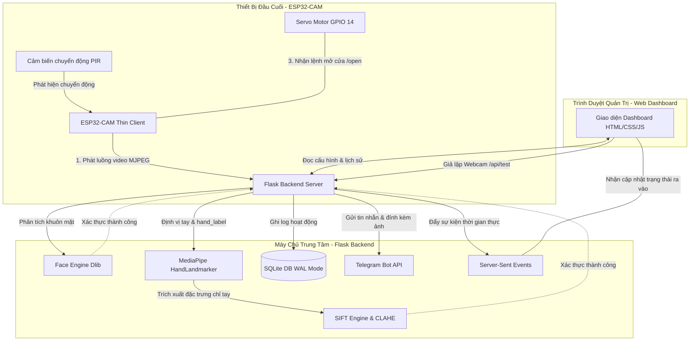

# 🚪 Smart Door Lock - Hệ Thống Khóa Cửa Thông Minh 🔐
> **Hệ thống khóa cửa thông minh cao cấp kết hợp Nhận dạng khuôn mặt, Xác thực lòng bàn tay (phân biệt Trái/Phải), Điều khiển Servo và Cảnh báo Telegram thời gian thực.**

[](https://www.python.org/)
[](https://flask.palletsprojects.com/)
[](https://opencv.org/)
[](https://developers.google.com/mediapipe)
[](https://www.espressif.com/)
[](https://www.sqlite.org/)

---

## 📸 Giao diện Dashboard (Web UI Premium)
Giao diện quản lý được thiết kế theo phong cách **Glassmorphism** hiện đại, tối ưu trải nghiệm trên cả máy tính và thiết bị di động (Responsive 100%):
- **Dashboard Tổng quan**: Theo dõi thời gian thực trạng thái kết nối ESP32, cảm biến chuyển động PIR, tổng số người dùng, số lần phát hiện người lạ, và đồng bộ **Giờ Server** thời gian thực (Ticking Clock).
- **Lịch sử ra vào**: Nhật ký hoạt động chi tiết (Thời gian, Họ tên, Phương thức xác thực, Độ tin cậy %, Trạng thái thành công/thất bại, Lý do chi tiết) cập nhật tự động liên tục thông qua Server-Sent Events (SSE).
- **Quản lý người dùng**: Thêm mới, phân quyền (Quản trị viên, Người dùng, Khách), xóa và đăng ký dữ liệu sinh trắc học.
- **Xem Camera trực tiếp**: Luồng video MJPEG độ trễ thấp từ ESP32-CAM.
- **Trình xác thực kép thử nghiệm (Webcam)**: Giả lập quy trình nhận dạng khuôn mặt và lòng bàn tay trực tiếp trên trình duyệt bằng Webcam.

---

## ✨ Tính năng nổi bật

### 1. 🛡️ Bảo mật kép sinh trắc học (Multi-biometric)
- **Nhận dạng khuôn mặt**: Sử dụng thư viện `face_recognition` (dựa trên Dlib) trích xuất 128 chiều khuôn mặt, hỗ trợ phát hiện và cảnh báo người lạ đột nhập ngay lập tức.
- **Xác thực lòng bàn tay (SIFT + MediaPipe)**: 
  - Sử dụng **MediaPipe HandLandmarker** định vị 21 khớp xương tay và tự động cắt vùng lòng bàn tay (ROI).
  - Áp dụng bộ lọc **CLAHE** để làm nổi rõ chỉ tay và các khớp ngón, trích xuất đặc trưng **SIFT** và so khớp bằng **BFMatcher** đạt độ chính xác tuyệt đối.
  - **Phân biệt tay Trái/Phải**: AI tự động phát hiện chiều tay đưa lên. Nếu người dùng đăng ký tay Trái nhưng lại đưa tay Phải khi quét, hệ thống sẽ chặn đứng và từ chối ngay lập tức (`Sai tay! Đăng ký tay Trái nhưng đưa tay Phải`).

### 2. ⚡ Đăng ký Burst-capture Siêu tốc (15 ảnh/5-7 giây)
- Không còn quy trình đăng ký chậm chạp từng ảnh một!
- Chế độ **Burst-capture** tự động nháy đèn flash camera và chụp liên tiếp **15 ảnh trong vòng 5-7 giây** với khoảng thời gian cực ngắn (~180ms - 200ms/ảnh) giúp lấy đầy đủ mọi góc mặt/tay của người dùng.
- Hỗ trợ tải tệp ảnh hàng loạt lên đến 15 ảnh cùng lúc.

### 3. 🚶 Cảm biến PIR & Thao tác rảnh tay
- Mạch ESP32-CAM tích hợp cảm biến chuyển động **PIR** siêu nhạy. Khi có người tiến đến gần cửa, cảm biến sẽ kích hoạt, tự động đánh thức camera và thực hiện chu trình nhận diện khuôn mặt tự động (Hands-free).

### 4. 📢 Động cơ âm thanh giọng nói (Audio Voice Engine)
- Hệ thống phát các file giọng nói tiếng Việt chuẩn chỉ tương ứng với từng trạng thái:
  - `"Nhìn thẳng vào camera..."` khi phát hiện chuyển động.
  - `"Vui lòng xòe lòng bàn tay..."` sau khi nhận diện khuôn mặt thành công.
  - `"Xin chào Nguyễn Văn A!"` khi mở cửa thành công.
  - `"Phát hiện người lạ, truy cập bị từ chối!"` khi có xâm nhập trái phép.
  - Đăng ký: `"Đang đăng ký khuôn mặt/bàn tay..."` và `"Đăng ký thành công!"`.

### 5. 🔒 Mã hóa dữ liệu Sinh trắc học & Database WAL
- Mọi dữ liệu hình ảnh đăng ký đều được mã hóa bằng thuật toán đối xứng **AES** (Fernet key lưu an toàn tại `data/secret.key`) trước khi lưu dưới dạng nhị phân (BLOB) vào SQLite.
- SQLite hoạt động ở chế độ **WAL (Write-Ahead Logging)** đảm bảo đọc/ghi dữ liệu lịch sử và sinh trắc học đồng thời cực nhanh mà không bị nghẽn (database is locked).

### 💬 6. Cảnh báo Telegram thời gian thực & Chống trùng lặp
- Gửi tin nhắn Telegram thông báo ngay lập tức:
  - Cửa mở thành công (Họ tên, Độ tin cậy %, Phương thức, Thời gian).
  - Đăng nhập thất bại (Lý do cụ thể như sai tay, độ tin cậy dưới 70%).
  - Cảnh báo người lạ (kèm **ảnh chụp khuôn mặt người lạ** đính kèm làm bằng chứng).
- **Backend-side Verification Cooldown**: Thuật toán tự động nhận biết nếu cửa vừa được mở do xác thực sinh trắc học thành công trong vòng 4 giây trước đó, các lệnh mở cửa vật lý tiếp theo sẽ được xử lý trong im lặng (silent) để tránh gửi thông báo và ghi log "Mở thủ công từ Web" trùng lặp.

---

## 📐 Sơ đồ kiến trúc hệ thống (Architecture)



---

## 🔌 Sơ đồ kết nối phần cứng (Pinout)

```
                       ┌─────────────────────────┐
                       │        ESP32-CAM        │
                       └─────────────────────────┘
                            │    │    │    │
         ┌──────────────────┘    │    │    └──────────────────┐
         │ (5V)                  │    │ (GND)                 │ (GPIO 14)
         ▼                       ▼    ▼                       ▼
   ┌───────────┐           ┌─────────────┐             ┌─────────────┐
   │ Nguồn 5V  │           │ Cảm biến PIR│             │ Servo Motor │
   │ (Adapter) │           │   (SR501)   │             │   (SG90)    │
   └───────────┘           └─────────────┘             └─────────────┘
      ▲   ▲                     │   ▲                     ▲   ▲
      │   └─────────────────────┼───┼─────────────────────┘   │
      └─────────────────────────┴───┴─────────────────────────┘
                               GND
```

| Thiết bị | Chân ESP32-CAM | Chân Linh Kiện | Ghi chú |
| :--- | :--- | :--- | :--- |
| **Nguồn 5V** | `5V` | `VCC` | Cấp nguồn ổn định (khuyên dùng Adapter 2A) |
| **Nguồn 5V** | `GND` | `GND` | Nối đất chung toàn mạch |
| **Cảm biến PIR** | `GPIO 13` | `OUT` | Chân nhận tín hiệu chuyển động |
| **Cảm biến PIR** | `5V` / `GND` | `VCC` / `GND` | Nguồn cấp cho cảm biến |
| **Servo Motor** | `GPIO 14` | `PWM` (Cam/Vàng) | Chân điều khiển Servo (Dùng PWM LEDC) |
| **Servo Motor** | `5V` / `GND` | `VCC` / `GND` (Đỏ/Nâu) | Nguồn cấp cho Servo |

---

## 💻 Hướng dẫn cài đặt & Khởi chạy

### 1. Yêu cầu hệ thống
- Hệ điều hành: Windows, Linux hoặc macOS.
- **Python 3.10** hoặc **3.11** (khuyên dùng để cài đặt `dlib` và `mediapipe` mượt mà nhất).
- Trình biên dịch C++ (Cần thiết để build Dlib):
  - **Windows**: Cài đặt [Visual Studio Community](https://visualstudio.microsoft.com/vs/community/) và chọn mục **Desktop development with C++**.
  - **Ubuntu/Debian**: `sudo apt-get install build-essential cmake g++ gfortran`

### 2. Cài đặt các gói phụ thuộc
Clone mã nguồn về máy tính, mở Terminal tại thư mục dự án và chạy:

```bash
# Tạo môi trường ảo (Khuyên dùng)
python -m venv .venv
.venv\Scripts\activate   # Trên Windows
source .venv/bin/activate # Trên Linux/macOS

# Nâng cấp pip lên bản mới nhất
python -m pip install --upgrade pip

# Cài đặt toàn bộ dependencies
pip install -r requirements.txt
```

### 3. Tải Model bổ sung cho MediaPipe
Tải file Model Hand Landmarker của Google MediaPipe để phục vụ nhận dạng chỉ tay:
- Tải file [hand_landmarker.task](https://storage.googleapis.com/mediapipe-models/hand_landmarker/hand_landmarker/float16/1/hand_landmarker.task).
- Đặt file này vào thư mục: `data/hand_landmarker.task`.

### 4. Khởi chạy Server Backend
Chạy file server trung tâm:

```bash
python server.py
```

Sau khi chạy thành công, Server sẽ tự động khởi tạo cơ sở dữ liệu SQLite `data/smartdoor.db`, sinh mã khóa bí mật `data/secret.key` nếu chưa có, và mở cổng lắng nghe tại:
- Web Dashboard: **`http://localhost:5000`** hoặc IP nội mạng của máy tính bạn (ví dụ: `http://192.168.1.100:5000`).

---

## 🔌 Cài đặt ESP32-CAM Firmware
1. Mở phần mềm **Arduino IDE**.
2. Cài đặt board hỗ trợ ESP32 (Thêm URL ESP32 vào Preferences và tải gói thư viện `esp32` của Espressif).
3. Mở file [esp32_door.ino](file:///d:/IOT/esp32_door.ino) có sẵn trong project.
4. Cấu hình các thông số WiFi nhà bạn và địa chỉ IP của Server máy chủ:
   ```cpp
   const char* ssid = "TÊN_WIFI_CỦA_BẠN";
   const char* password = "MẬT_KHẨU_WIFI_CỦA_BẠN";
   const char* server_ip = "192.168.1.100"; // IP của máy tính chạy server.py
   ```
5. Chọn Board là **AI Thinker ESP32-CAM**, chọn đúng Port COM và tiến hành nạp code.

---

## 🛠️ Hướng dẫn Sử dụng Hệ thống

1. **Đăng ký tài khoản & Sinh trắc học**:
   - Truy cập giao diện quản trị `http://localhost:5000`.
   - Chọn tab **Người dùng** -> Nhấp **Thêm người dùng**.
   - Sau khi tạo, bấm nút **Đăng ký khuôn mặt** hoặc **Đăng ký bàn tay**.
   - Mở Webcam trên máy tính hoặc sử dụng Camera của ESP32-CAM để thực hiện chụp 15 ảnh liên tục. Nhớ xoay nhẹ góc khuôn mặt hoặc lòng bàn tay để hệ thống ghi nhận chính xác nhất.
   
2. **Quy trình Xác thực tự động (Trước cửa)**:
   - Khi có người đến gần, cảm biến **PIR** phát hiện -> ESP32 bật đèn đỏ flash nhẹ và truyền luồng MJPEG.
   - Giao diện Web/Server phát âm thanh: *"Nhìn thẳng vào camera để nhận dạng..."*.
   - Camera nhận diện khuôn mặt thành công -> Phát âm thanh: *"Vui lòng xòe lòng bàn tay..."*.
   - Người dùng xòe lòng bàn tay (tay đã đăng ký). Hệ thống đối chiếu SIFT + Chiều tay (Trái/Phải).
   - Nếu khớp -> Phát âm thanh: *"Xin chào [Tên]! Cửa đã mở."* -> Gửi tín hiệu PWM quay Servo 90 độ mở chốt cửa trong 5-10 giây -> Gửi tin nhắn và log lịch sử.
   - Nếu phát hiện người lạ -> Chụp ảnh và gửi khẩn cấp lên Telegram bot cảnh báo.

3. **Xem Nhật ký**:
   - Nhấp vào tab **Lịch sử ra vào** trên Web Dashboard để xem toàn bộ thông tin chi tiết các lần ra vào của các thành viên trong gia đình được cập nhật động liên tục không cần tải lại trang.

---

## 📄 Bản quyền & Phát triển
*Dự án được xây dựng và phát triển trên nền tảng Mã nguồn mở phục vụ cho mục đích học tập, nghiên cứu hệ thống IoT và Trí tuệ nhân tạo nhận dạng Sinh trắc học tiên tiến.*

> [!NOTE]
> Để hệ thống hoạt động ổn định nhất, hãy luôn sử dụng nguồn cấp 5V-2A riêng biệt cho ESP32-CAM để tránh hiện tượng sụt áp khi Servo SG90 hoạt động quay chốt cửa.
